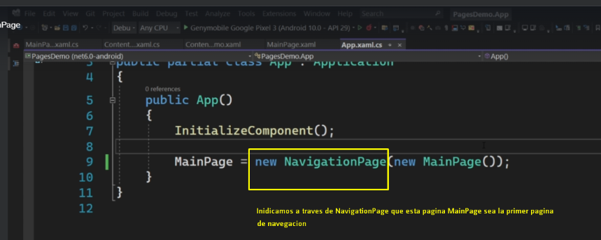

# FirstApp

## Pagina de tipo ContentPage utilizando navegacion


* Al utilizar la navegacion, forzosamente tenemos que agregarle
navegacion a la primer pagina con la cual empezamos


**File MainPage.xaml**
```xaml
<Button
    x:Name="CounterBtn"
    Text="Click me"
    SemanticProperties.Hint="Counts the number of times you click"
    Clicked="Button_Clicked"
    HorizontalOptions="Center"/>
```

```xaml
<?xml version="1.0" encoding="utf-8" ?>
<ContentPage xmlns="http://schemas.microsoft.com/dotnet/2021/maui"
             xmlns:x="http://schemas.microsoft.com/winfx/2009/xaml"
             x:Class="MauiApp1.MainPage">

    <ScrollView>
        <VerticalStackLayout
            Spacing="25"
            Padding="30,0"
            VerticalOptions="Center">

            <Image
                Source="dotnet_bot.png"
                SemanticProperties.Description="Cute dot net bot waving hi to you!"
                HeightRequest="200"
                HorizontalOptions="Center" />

            <Label
                Text="Hello, World!"
                SemanticProperties.HeadingLevel="Level1"
                FontSize="32"
                HorizontalOptions="Center" />

            <Label
                Text="Welcome to .NET Multi-platform App UI"
                SemanticProperties.HeadingLevel="Level2"
                SemanticProperties.Description="Welcome to dot net Multi platform App U I"
                FontSize="18"
                HorizontalOptions="Center" />

            <Button
                x:Name="CounterBtn"
                Text="Click me"
                SemanticProperties.Hint="Counts the number of times you click"
                Clicked="Button_Clicked"
                HorizontalOptions="Center"/>
        </VerticalStackLayout>
    </ScrollView>

</ContentPage>

```

**File MainPage.xaml.cs**
```c#
private void Button_Clicked(object sender, EventArgs e)
{
    Navigation.PushAsync(new ContentPageDemo());
}
```

**File App.xaml.cs**
```c#
//                                              //Pagina de tipo ContentPage utilizando Navegacion.
var navPage = new NavigationPage(new MainPage());
navPage.BarBackground = Colors.SpringGreen;
MainPage = navPage;
```


## Pagina de tipo Flayout

Para crearlo, se necesita primero crear una pagina de tipo ContentPage
y despues a la etiqueta de ContentPage se renombra por `FlyoutPage`
y se le agrega adentro la propiedad `FlyoutPage.Flyout` y `<FlyoutPage.Detail>`

**File FlayoutPageDemo.xaml**
```xaml
<?xml version="1.0" encoding="utf-8" ?>
<FlyoutPage xmlns="http://schemas.microsoft.com/dotnet/2021/maui"
             xmlns:x="http://schemas.microsoft.com/winfx/2009/xaml"
             x:Class="MauiApp1.FlayoutPageDemo"
             Title="FlayoutPageDemo">
    <FlyoutPage.Flyout>
        <ContentPage Title="My App" BackgroundColor="Yellow">
            <Label Text="Hello From Flyout"
                   HorizontalTextAlignment="Center"
                   VerticalTextAlignment="Center"
                   >
                
            </Label>
        </ContentPage>    
    </FlyoutPage.Flyout>
    
    <FlyoutPage.Detail>
        <ContentPage >
            <Label Text="Hello From Detail"
               HorizontalTextAlignment="Center"
               VerticalTextAlignment="Center"
               >
            </Label>
        </ContentPage>
    </FlyoutPage.Detail>
</FlyoutPage>
```

**File App.xaml.cs**
```c#
//                                              //Pagina de tipo FlyoutPage.
MainPage = new FlayoutPageDemo();
```


## Pagina de tipo Tabbed
Para crearlo, se necesita primero crear una pagina de tipo ContentPage
y despues a la etiqueta de ContentPage se renombra por `TabbedPage`
y se le agregan sus demas propiedades


```xaml
<?xml version="1.0" encoding="utf-8" ?>
<TabbedPage xmlns="http://schemas.microsoft.com/dotnet/2021/maui"
             xmlns:x="http://schemas.microsoft.com/winfx/2009/xaml"
             x:Class="MauiApp1.TiposPaginas.FTabbedPage.TabbedPageDemo"
             Title="TabbedPageDemo"
            BarBackground="DarkBlue"
            BarTextColor="LightSalmon"
            SelectedTabColor="DarkRed"
            UnselectedTabColor="DarkKhaki"
            >
    <ContentPage Title="Page 1" IconImageSource="dotnet_bot.svg">
        
    </ContentPage>
    <ContentPage Title="Page 2" IconImageSource="dotnet_bot.svg">

    </ContentPage>
    <ContentPage Title="Page 3" IconImageSource="dotnet_bot.svg">
        <Label Text="Demo"/>
    </ContentPage>
</TabbedPage>
```


**File App.xaml.cs**
```c#
//                                              //Pagina de tipo TabbedPage
MainPage = new TabbedPageDemo();
```

